 

### 作者QQ：1556708905(支持修改、 部署调试、 支持代做毕设)

#### 支持代做任何毕设论、接网站建设、小程序、H5、APP、各种系统等

**毕业设计所有选题地址 [https://github.com/zhengjianzhong0107/allProject](https://github.com/zhengjianzhong0107/allProject)**

**博客地址：[https://blog.csdn.net/2303_76227485/article/details/128684156](https://blog.csdn.net/2303_76227485/article/details/128684156)**

**视频演示：[https://space.bilibili.com/384537280](https://space.bilibili.com/384537280)**

 

## 基于Springboot的社区论坛系统(源代码+数据库)

## 一、系统介绍

前台：

- 话题列表，搜索话题，发布话题
- 通过标签筛选话题
- 个人设置：修改个人信息，查看发布话题记录，修改密码，修改头像

后台管理管理员登录：

- 话题列表的管理，话题可置顶、设置为精华话题，
- 评论管理
- 标签管理
- 用户管理
- 后台用户管理
- 后台用户管理
- 角色管理
- 权限管理

## 二、所用技术

后端技术栈：

- JDK8
- SpringBoot
- MyBatis
- Shiro
- MySQL

前端技术栈：

- Freemarker
- Bootstrap

## 三、环境介绍

基础环境 :IDEA/eclipse, JDK 1.8, Mysql5.7及以上,Maven

源码+数据库脚本

所有项目以及源代码本人均调试运行无问题 可支持远程调试运行

## 四、页面截图

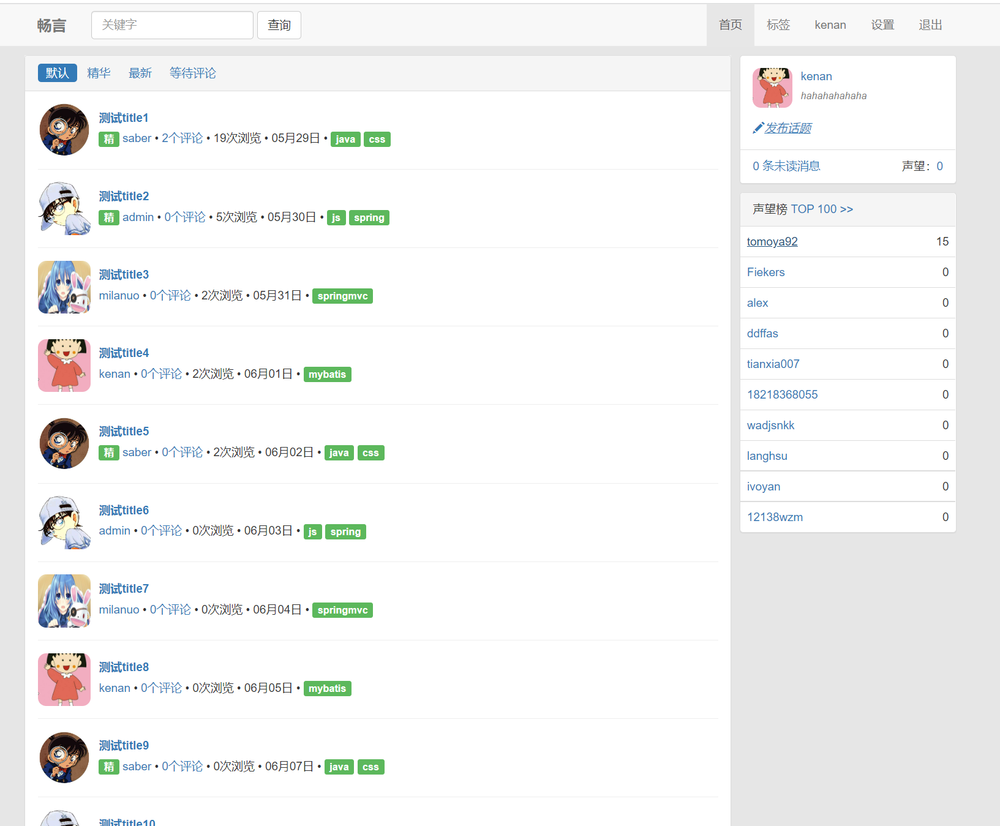

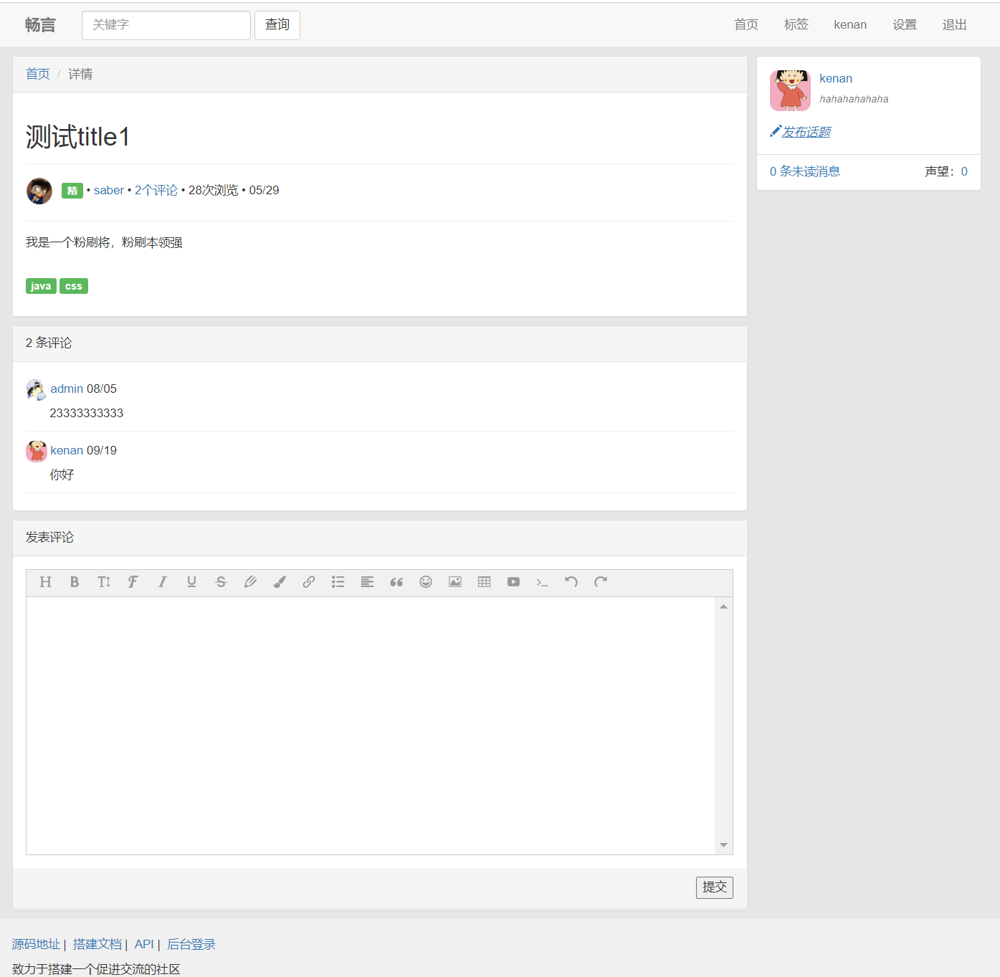

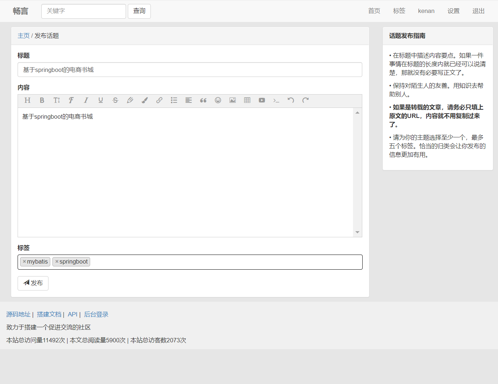

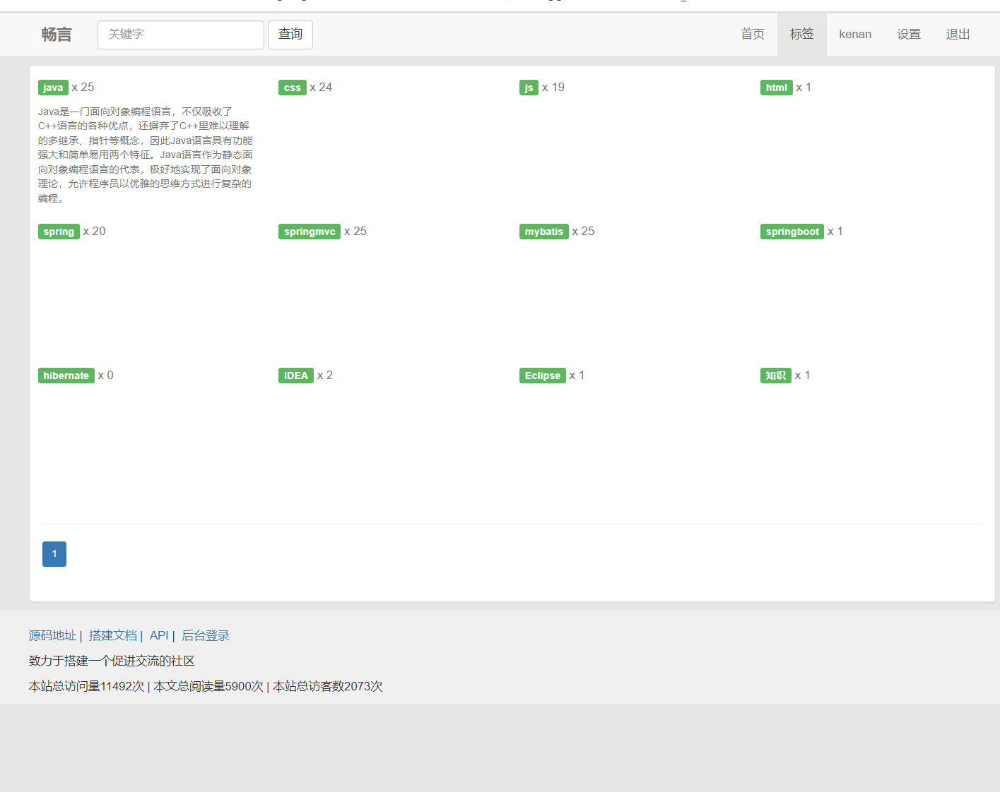

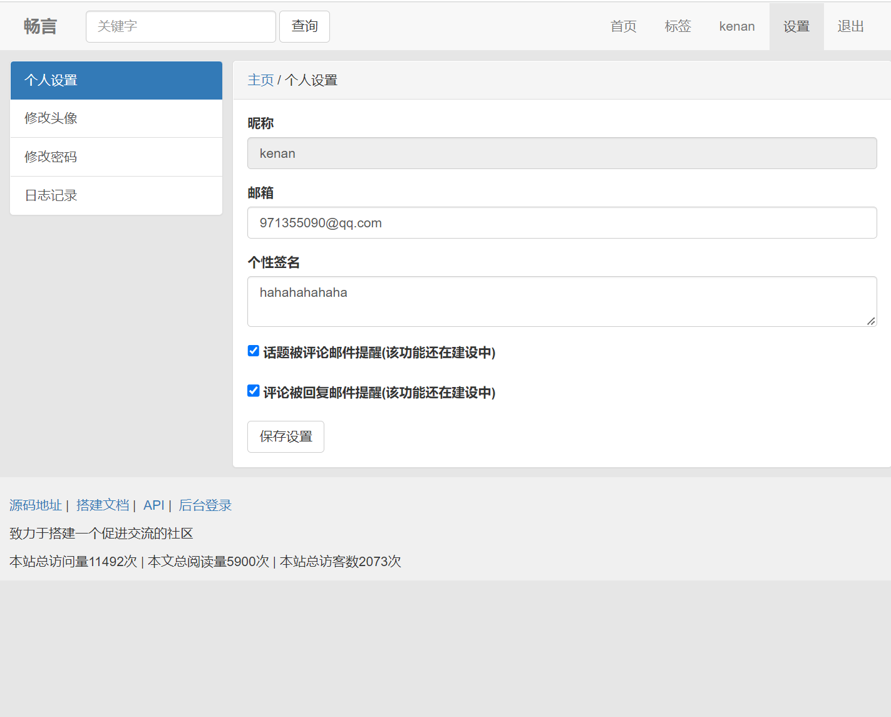

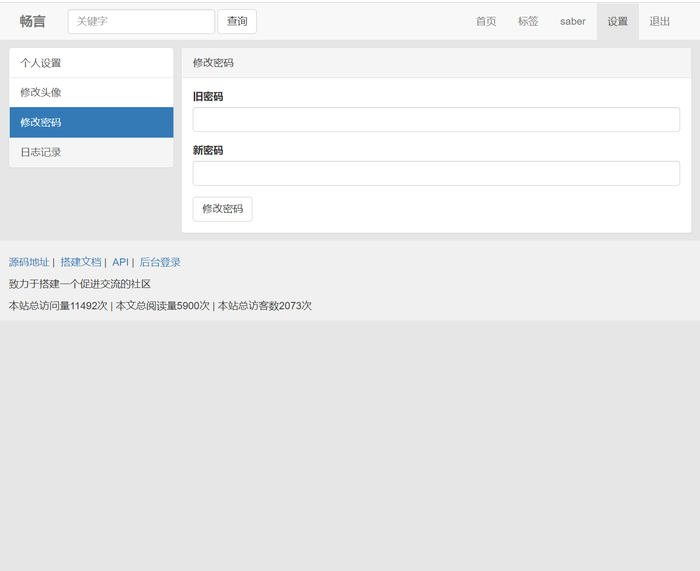

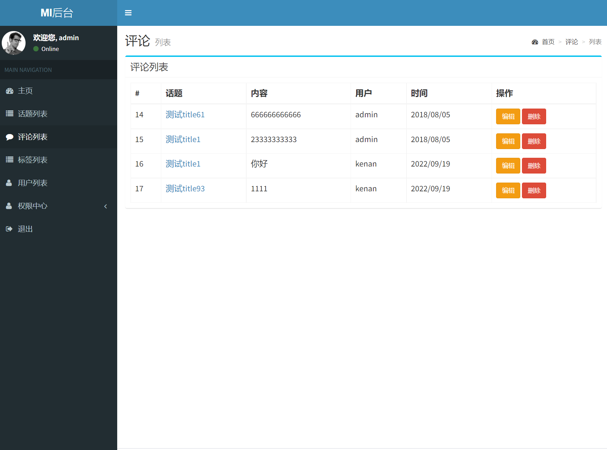

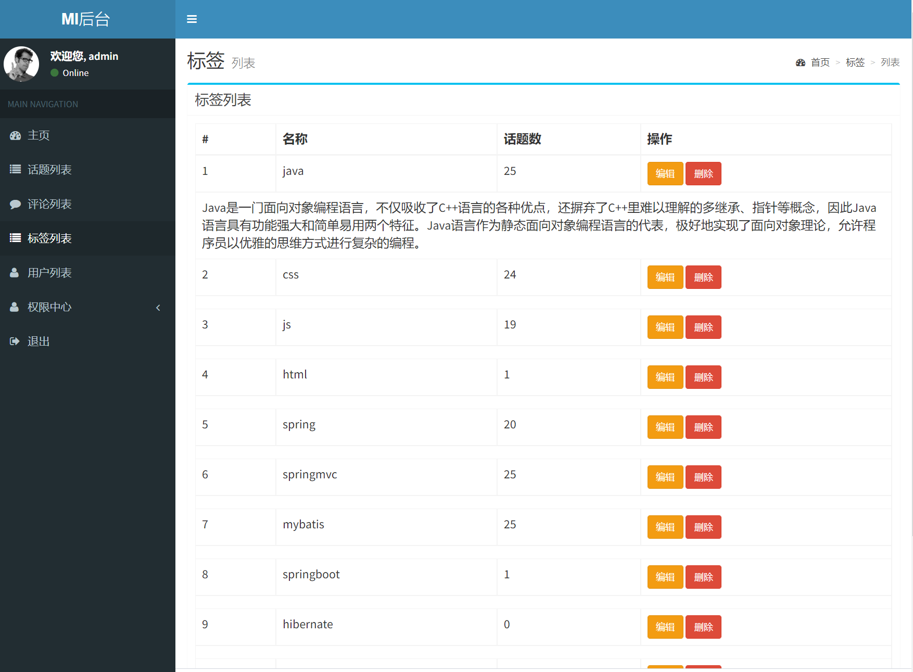

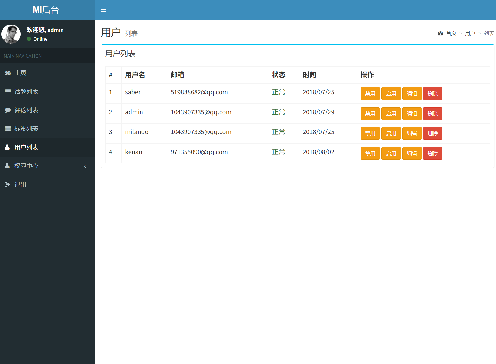

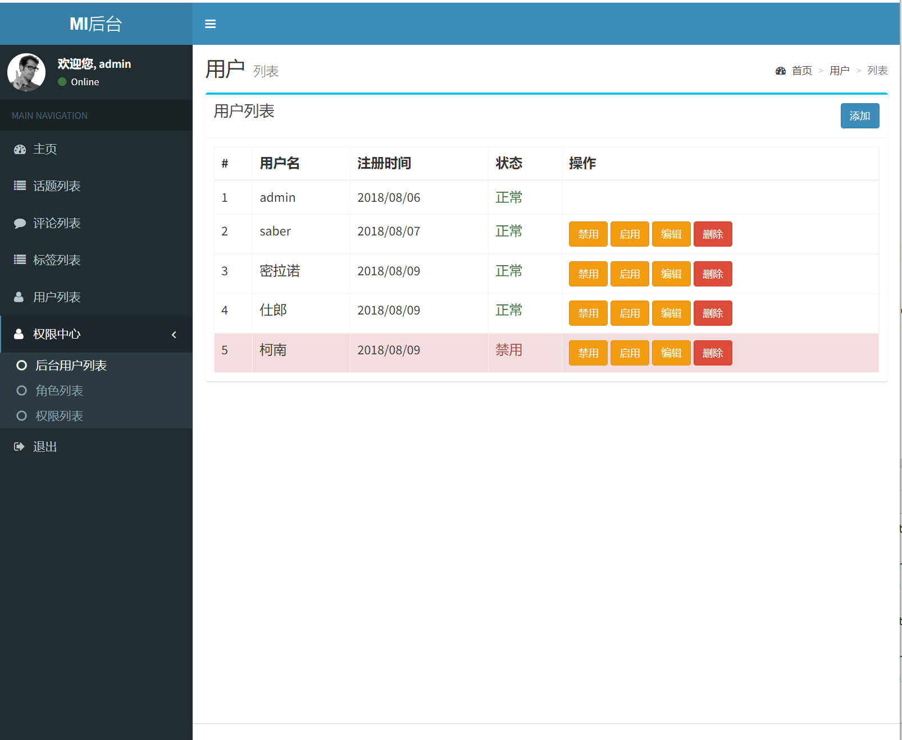

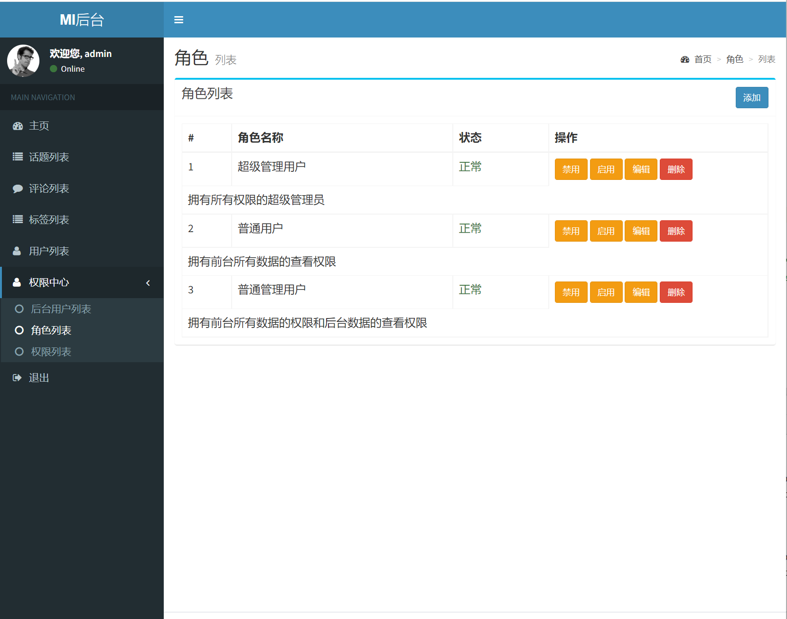

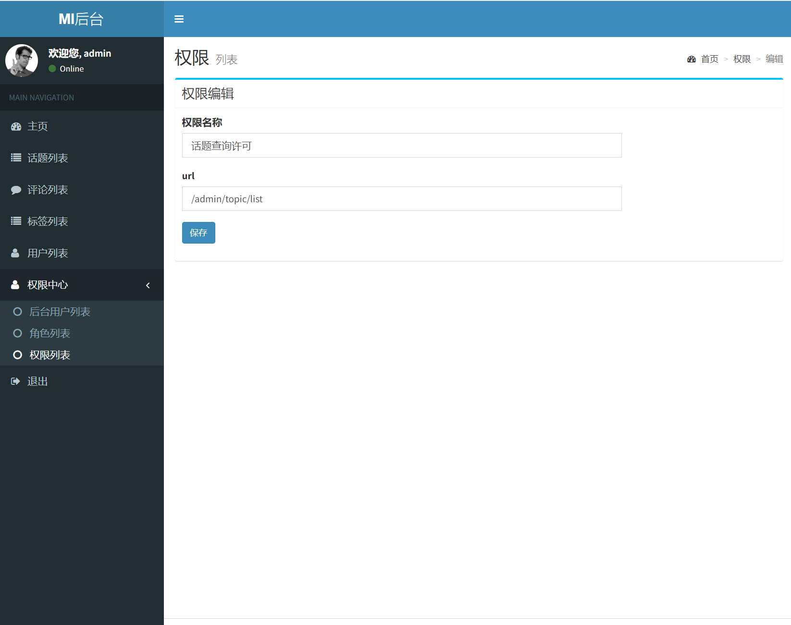

## 五、浏览地址

- 前台页面访问 `http://localhost:8134/index`  用户名: kenan 密码: 123456
- 后台页面访问 `http://localhost:8134/admin/login` 用户名: admin 密码: admin

## 六、安装教程

1. 使用Navicat或者其它工具，在mysql中创建对应名称的数据库，并导入项目的sql文件；
2. 使用IDEA/Eclipse/MyEclipse导入项目，Eclipse/MyEclipse导入时，若为maven项目请选择maven;
   
   若为maven项目，导入成功后请执行maven clean;maven install命令，然后运行；
3. 修改application.yml 里面的数据库配置
4. 启动项目后端项目
5. 访问  http://localhost:8134/index

 
